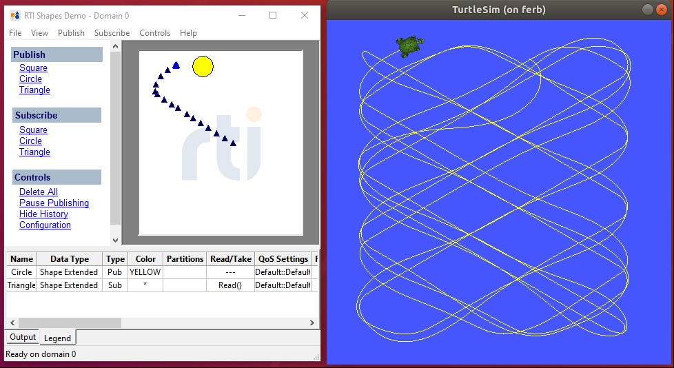

# ros2-interop-demos
Demonstration DDS apps that interoperate with ROS 2.  
ROS 2 runs primarily on DDS, which means that all ROS 2 applications are DDS applications; 
DDS and ROS 2 applications can be freely intermixed.  
These examples show how a native/non-ROS2 DDS application can interoperate with ROS2-on-DDS through 3 of
its 4 primary patterns:  
 * Messages (*.msg files), a one-way pub-->sub sending of a data topic.
 * Services (*.srv files), a request/reply pattern that sends a topic and expects a response on a paired topic.
 * Actions (*.action files), a request/reply pattern that also provides a 'feedback' topic to monitor progress.

Note that 'parameter' topics are not yet covered in these examples.  
These examples interoperate with two of the most popular ROS2 applications: RViz, and TurtleSim.


## Building the examples: 
This uses CMAKE to create the makefile or other build files (Visual Studio, Ninja, Eclipse, etc.).  
To build, do the following: 

 1. Clone this repository to a local directory on a build host for RTI Connext (Linux, Windows, MacOS).

 2. From this directory, create and cd to a build directory  
    ```
      mkdir build  
      cd build
    ```
  
 3. Ensure that the environment variable NDDSHOME is set to your Connext installation location. 
    This can be done easily by running the `"rti_setenv_*"` script or batch file, 
    located in `<Connext-Install-Dir>/resources/scripts/`
    
 4. Use CMake to create the makefile or build file for your target system.  
    In most cases this will only require:
    ```
      cmake ..
    ```

    Some build hosts may have multiple toolchain installations and will need to 
    specify the toolchain type for CMake.  
    For example:
    ```
      Linux:    cmake -G "Unix Makefiles" ..
      Windows:  cmake -G "Visual Studio 15 2017" -A x64 ..
    ```
    
    Additionally, if you have multiple RTI Connext targets installed on your host system, it may
    be better to specify the intended target selection on the CMake command line, using
    the -DCONNEXTDDS_ARCH=(intended architecture) switch, as in:
    ```
      cmake -DCONNEXTDDS_ARCH=x64Linux4gcc7.3.0 -G "Unix Makefiles" ..
    ```

    NOTE: to build for Debug or Release, pass the -DCMAKE_BUILD_TYPE=Release (or Debug (default)) switch to CMake:
    
 5. Build the example. 
    ```
      Linux:    make
      Windows:  devenv ros2_interop_demos.sln
    ```

## Running the examples:  

These applications should be launched from the root folder of this project (this folder) to give the
applications direct access to the `USER_QOS_PROFILES.xml` file to set QoS properties.  

### **rviz_all** 
`build/rviz_all <domain_id>`  
Where: `<domain_id>` is an integer argument to select the DDS domain ID that the application will participate in.  Defaults to 0.    
This example demonstrates how to send data to the ROS 2 'RViz' visualizer, for a majority of the 
data types that it can display.   These data types are exported on ROS 2 compatible topics, and can
be visualized using the RViz 'Add' button and selecting the topics under the 'By Topic' tab.  
The data types are as follows:  

 * **PointCloud2**: Demo app reads image data from files at `src/rviz_demo/img` and publishes point cloud data from randomly selects pixels from the input image.   Topic name: `rt/lidar_points`. 
 This data can be displayed in RViz using the 'PointCloud2' display type, and will be rendered
 in the main view along the X and Z axes at Y=5 baseline.  See image below.

 * **Image**: Data from the same image files as above are scaled-down to a 320x200 image, and publsihed on the topic name: `rt/cam_image`. This data can be displayed using the RViz 'Image' display type and will appear in the image viewer of RViz, usually in lower-left corner.

 * **OccupancyGrid**: Data from the same image files as above are scaled-down to a 96x96 pixel grayscale image and published on the topic name: `rt/floor_map`.  This data can be displayed using
 the RViz 'Map' display type and will appear in the floor grid of RViz (see image below).

 * **PoseStamped**: This produces a single pose indicator that is updated to ~random locations within
 an area of the main view.  It appears as a red arrow unless otherwise modified.  Topic name is: `rt/pose_val`.  

 * **Marker**: This produces a series of persisting markers (small green arrows) in RViz, at random
 locations within an areao of the main display.  Topic name is `/rt/test_mark`.

 * **PoseArray**: This produces a set of (10) 'pose' indicators (red arrows by default) that are updated
 to move in a circular pattern around the Z axis.  Topic name is `rt/pose_vals`.  

 * **MarkerArray**: This produces a test of (10) text 'markers' that are paired with the above PoseArray.  These are positioned slightly above the Pose arrows.  Topic name is: `rt/test_markers`.  

 * **Odometry**: This produces a persisting red arrow by default in RViz.  Topic name is `rt/test_odom`.  

 * **Path**: This produces a green line with 10 random-point segments, within an area in RViz main display.
 Topic name is `rt/test_path`.  

 * **FluidPressure**: This produces fluid pressure data on the topic `rt/test_pressure`.  It appears in RViz as
 a single point at the XYZ origin.

 * **Polygon**:  This produces a green-line 'frame' around the 10x10x10 main viewing are of RViz, with some 
 random movement as well.  Topic name is `rt/test_poly`.  

Rendering in RViz2 will produce:


### **turtle_shapes**  
This example is an interoperation between the 2 primary demo applications of DDS: Shapes Demo, and ROS 2: TurtleSim.  
This application covers 3 of the 4 main communcation types in ROS 2: Message (`.msg`), Service (`.srv`), and 
Action (`.action`) types on the ROS 2 side, as well as publishing and subscribing with Shapes Demo on the DDS side.  

The application subscribes to Circle or Square data from RTI Shapes Demo, and will spawn a turtle in the ROS 2 TurtleSim demo for each shape and color it finds.   The Shapes Demo topics it uses are:

 * **Square** shapes will position the turtle using a ROS2 Service call for absolute positioning.

 * **Circle** shapes will position the turtle using a ROS2 Message for forward motion and turn angle, with feedback of the turtle's location used to create an error signal for a PID controller.  This PID controller has default tuning
 for low-latency connection (shared memory or UDP loopback) and may need to be adjusted to accurately position the turtle in your environment.
 
 ** **Triangle** shapes may be subscribed-to in Shapes Demo to see the reported position of the Circle turtles.  

Note that each turtle in TurtleSim will drag a colored 'pen' line to mark their movement, matching the color of the
shape in Shapes Demo that directs their path.



NOTES.  
 * This demo repo has been modified in 2024 to no longer require the RTI [ros-data-types](https://github.com/neil-rti/ros-data-types) library for ROS2 data type support (this was done only to accelerate initial build of these demo apps, the results are the same).
 Data type definitions for each project are in an IDL file located in the `src/generated` directory.   
 The code generator `rtiddsgen` is automatically invoked as needed during the build process for these demos.
 

